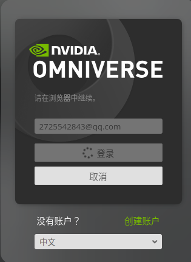
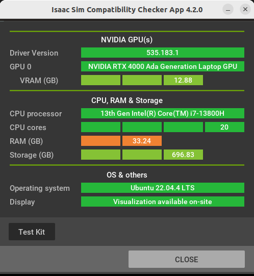

### 参考官方github：https://github.com/isaac-sim/IsaacLab

### 兼容性检测器
- 参考：https://docs.omniverse.nvidia.com/isaacsim/latest/installation/requirements.html#system-requirements
    1. 下载 Omniverse Launcher：https://developer.nvidia.com/omniverse#section-getting-started
    2. 安装过程遇到问题：
        - 
        - 解决办法：https://blog.csdn.net/zkf0100007/article/details/143645806
        - 其他问题，可参考：https://blog.csdn.net/zkf0100007/category_12828060.html
- 检测结果：
    - 

### 安装isaac-sim
- 参考：https://isaac-sim.github.io/IsaacLab/main/source/setup/installation/pip_installation.html
- 补充：
    - ` nvidia-smi`查看CUDA版本信息(本机为12.2)
    - `PyTorch `下载比较慢