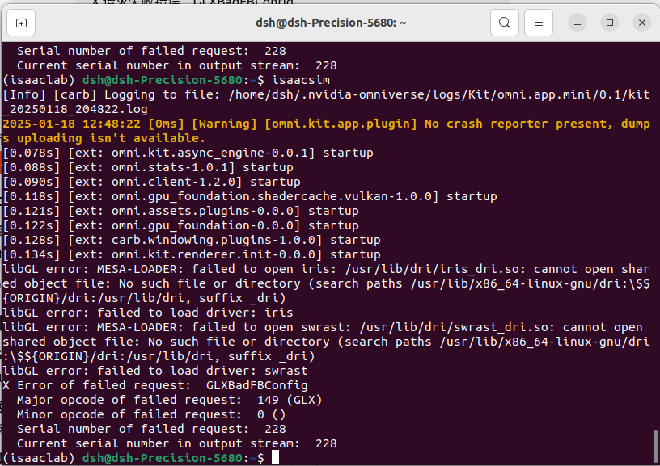

### 参考官方github：https://github.com/isaac-sim/IsaacLab

### 兼容性检测器
- 参考：https://docs.omniverse.nvidia.com/isaacsim/latest/installation/requirements.html#system-requirements
    1. 下载 Omniverse Launcher：https://developer.nvidia.com/omniverse#section-getting-started
    2. 安装过程遇到问题：
        - 
        - 解决办法：https://blog.csdn.net/zkf0100007/article/details/143645806
        - 其他问题，可参考：https://blog.csdn.net/zkf0100007/category_12828060.html
- 检测结果：
    - 


### 安装isaac-sim
- 参考：https://isaac-sim.github.io/IsaacLab/main/source/setup/installation/pip_installation.html
- 补充：
    - ` nvidia-smi`查看CUDA版本信息(本机为12.2)
    - `PyTorch `下载比较慢
    - `isaacsim` 会下载依赖，可能比较慢
- 遇到的问题
    - 运行`isaacsim`，出想错误
    - 解决方法：https://blog.csdn.net/weixin_43686259/article/details/141135736

### conda命令
- `conda create -n isaaclab python=3.10`
- `conda activate isaaclab`
- `conda deactivate`

### 安装isaac-lab
- 参考：https://isaac-sim.github.io/IsaacLab/main/source/setup/installation/pip_installation.html

- 安装依赖时，可能失败，自己单独安装
    - `pip install protobuf==4.25.5 -i https://pypi.tuna.tsinghua.edu.cn/simple`
    - `pip install pyglet==1.5.31 -i https://pypi.tuna.tsinghua.edu.cn/simple`
    - `pip install torch==2.4.0 -i https://pypi.tuna.tsinghua.edu.cn/simple`
- 问题：
    - 遇到的错误表明在尝试从 GitHub 克隆 `robomimic` 仓库时连接超时。可能是网络问题、较慢的网络连接或 GitHub 暂时不可用。

你可以尝试以下方法来解决这个问题：

### 1. **检查网络连接**
确保你的互联网连接稳定。你可以尝试运行以下命令检查与 GitHub 的连接：

```bash
ping github.com
```

如果你发现延迟高或丢包，这可能是导致连接超时的原因。切换到其他网络或排查连接问题可能会有所帮助。

### 2. **增加 Git 克隆超时**
你可以增加 Git 克隆的超时时间，给予它更多时间来克隆仓库。设置 Git 配置选项以延长超时时间：

```bash
git config --global http.timeout 600
```

然后重新运行安装命令。

### 3. **手动克隆仓库**
如果问题仍然存在，你可以尝试手动克隆 `robomimic` 仓库：

1. 直接克隆仓库到本地：
   
   ```bash
   git clone https://github.com/ARISE-Initiative/robomimic.git
   ```

2. 克隆后，进入该目录：

   ```bash
   cd robomimic
   ```

3. 从本地仓库安装包：

   ```bash
   pip install . -i https://pypi.tuna.tsinghua.edu.cn/simple
   ```

然后，再次尝试安装其余依赖项。

