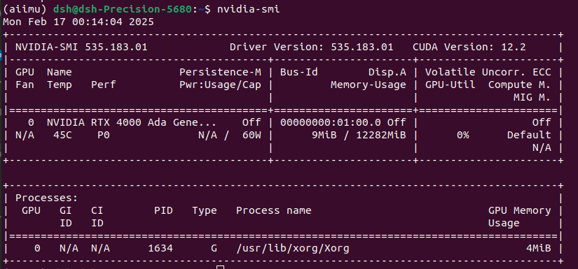
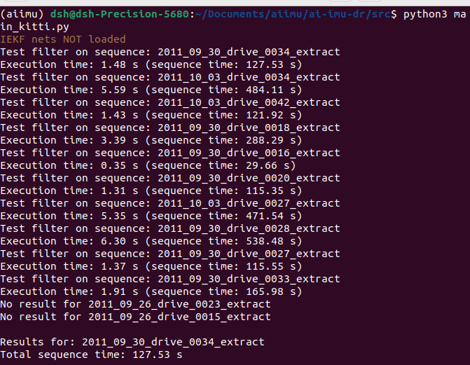

## 参考：https://github.com/mbrossar/ai-imu-dr?tab=readme-ov-file

### 创建conda环境
- `conda create -n aiimu python=3.5`
- `conda activate aiimu` 进入环境
### 安装 [Pytorch](https://pytorch.org/)
- 查看cuda版本`nvidia-smi`
    - 
    - cuda12.2
    - pytorch以往版本：https://pytorch.org/get-started/previous-versions/
    - conda，v2.1.0，CUDA 12.1命令：`conda install pytorch==2.1.0 torchvision==0.16.0 torchaudio==2.1.0 pytorch-cuda=12.1 -c pytorch -c nvidia`

- 不行，python3.5太老了，不好找对应的pytorch
    - 删除`conda env remove --name aiimu`
    - 重新创建`conda create -n aiimu python=3.10`
    - 安装`conda install pytorch==2.1.0 torchvision==0.16.0 torchaudio==2.1.0 pytorch-cuda=12.1 -c pytorch -c nvidia`
### 安装必要软件包
    - `conda install matplotlib numpy termcolor scipy navpy`

### 接着按教程
- 代码位置：documents/aiimu
- temp.zip数据集被删除
- numpy版本问题：conda install numpy=1.23

- 测试`python3 main_kitti.py`结果

### 代码解释
main_kitti.py

