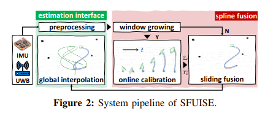
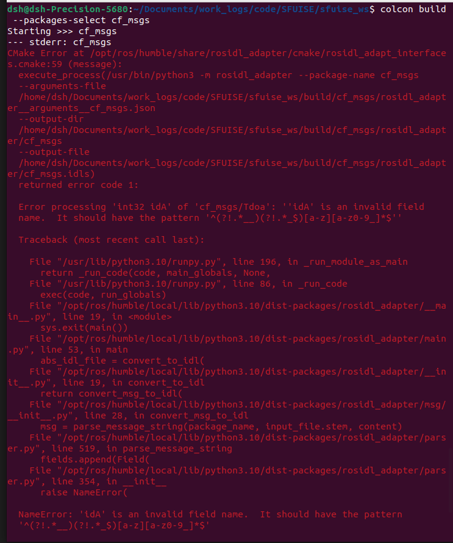
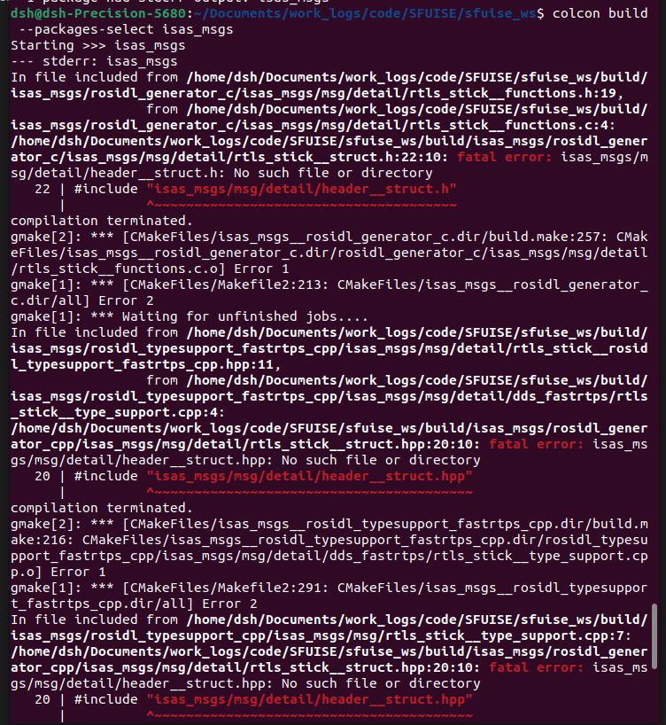

- sfuise系统
- 
## sfuise/src/EstimationInterface.cpp
- 对应sfuise系统的估计接口部分
- main:
    - 创建ros节点
    - EstimationInterface实例
- EstimationInterface类：
    - 读取参数配置
        - 参数来历TDOA：sfuise_test_util.launch--->config/config_test_util.yaml
        - 参数来历TOA：sfuise_test_isas-walk1.launch--->config/config_test_isas-walk1.yaml
    - 读取控制点帧率，计算时间间隔

    | 订阅话题 | 话题名 |其他说明|
    | --- | --- | --- | 
    | 启动时间 | "/SplineFusion/start_time" |
    | IMU数据 | "topic_imu" |
    | UWB数据 | "topic_uwb" |
    |TDOA/RTLS（TDOA:一种UWB数据；RTLS：UWB自建数据集）|"/tdoa_data"或"/rtls_flares"|
    |锚点列表(仅RTLS)|"/anchor_list"|如果是TDOA，则从文件中获取|
    |VIVE跟踪器数据/位姿数据|"/vive/transform/tracker_1_ref"或"/pose_data"|获取地面真实位置信息|
    |系统标定数据|"/SplineFusion/sys_calib"|设置导航数据|
    |估计窗口数据|"/SplineFusion/est_window"|处理样条节点，如果启用导航UWB，则发布优化结果|

    | 发布话题 | 话题名 |
    | --- | --- |  
    | IMU数据 | "imu_ds" |
    |TDOA/RTLS话题（TDOA:一种UWB数据；RTLS：UWB自建数据集）|"tdoa_ds"或"toa_ds"|
    |锚点可视化点云|"visualization_anchor"|
    |锚点列表|"anchor_list"|
    |旧的B样条优化路径(坐标系为map)|"bspline_optimization_old"|
    |当前B样条优化窗口|"bspline_optimization_window"|
    |优化位姿的可视化标记，并设置优化位姿可视化的颜色|"opt_pose"|

### 样条处理

## sfuise/src/SplineFusion.cpp
- 对应sfuise系统的样条融合部分
- main:
    - 创建ros节点
    - SplineFusion实例
    - 执行样条融合(run)
- SplineFusion类:
    - 读取参数配置
        - 参数来历TDOA：sfuise_test_util.launch--->config/config_test_util.yaml
        - 参数来历TOA：sfuise_test_isas-walk1.launch--->config/config_test_isas-walk1.yaml

    | 订阅话题 | 话题名 |其他说明|
    | --- | --- | --- | 
    |IMU数据|"/EstimationInterface/imu_ds"|
    |锚点列表|"/EstimationInterface/anchor_list"|
    |TDOA/RTLS|"/EstimationInterface/tdoa_ds"或"/EstimationInterface/toa_ds"|
    

    | 发布话题 | 话题名 |
    | --- | --- |  
    |活动控制点的点云消息|"active_control_points"|
    |非活动控制点的点云消息|"inactive_control_points"|
    |系统校准消息|"sys_calib"|
    |估计窗口消息|"est_window"|
    |启动时间消息|"start_time"|

- run函数：
    - 初始化：
        - 时间同步：获取IMU、TOA、TDOA缓冲区的最新时间戳，确定当前滑动窗口的时间范围。
        - 控制点动态扩展：根据传感器数据动态扩展样条（Spline）的控制点（Knots），若最新传感器数据时间超过当前样条的最大时间（min_time > spline_local.nextMaxTimeNs()），需添加新控制点。
        - 状态初始化：
            - IMU主导模式（if_uwb_only = false）：（TOA）
                - 使用 IMU预积分 推算下一节点的姿态（q_ini）和位置（pos_ini）。
            - 纯UWB模式（if_uwb_only = true）：（TDOA）
                - 通过 TDOA多边定位（tdoaMultilateration）估计初始位置。
                - 姿态初始化为单位四元数（假设初始无旋转）。
        - 初始化参数和样条
    - 显示控制点
        - 发布活动控制点和非活动控制点
        - 位置信息来源：spline_local
    - 执行优化
        - 节点数小于2,返回0
        - UWB分类：不在优化中的拒绝UWB，**在优化中的拒绝UWB**，不拒绝UWB
        - 如果窗口计数达到校准数，则不优化重力，不优化变换
        - 更新IMU测量，更新tdoa/toa
        - 更新线性化器大小
            - 如果不只使用UWB，则添加IMU数据
        - **迭代优化**：基于LM算法迭代优化过程
            1. 创建线性化器
            2. 遍历IMU、TDOA、TOA数据窗口，累加各传感器的残差项到优化问题中
            3. 收敛性检查
            4. 求解增量：阻尼项计算，求解线性系统
            5. 步长评估与调整：备份状态，应用增量，步长质量评估
            6. 终止条件：梯度足够小（收敛），增量或相对误差变化低于阈值（局部最优），lambda达到上限（无法进一步优化）
    - 更新窗口计数，更新窗口数
    - 创建样条消息，并获取样条消息
    - 发布估计消息
    - 显示处理后的控制点

### 迭代优化
    - LM自适应阻尼：通过lambda动态调整高斯-牛顿法和梯度下降的权重。

 
## 测试代码命令
- 在 UTIL (TDoA-inertial)上运行 sfuise 的示例：
    - `roslaunch sfuise sfuise_test_util.launch`
    - `rosbag play const1-trial1-tdoa2.bag`
- 在 ISAS-Walk (ToA-inertial，自建数据集) 上运行 sfuise 的示例：
    - `roslaunch sfuise sfuise_test_isas-walk1.launch`
    - `rosbag play ISAS-Walk1.bag`

## 转为ros2
### 问题
1. 
- ros2消息名称不能有大写
- 修改了Flow.msg,Tdoa.msg

2. 
- 修改了RTLSStick.msg：std_msgs/Header header

3. `sudo apt install ros-humble-visualization-msgs`

### sfuise主文件改写
- launch文件
- src中主文件
    - EstimationInterface
    - SplineFusion
- include
- CMakeLists.txt
- package.xml
- 数据集

文心快码